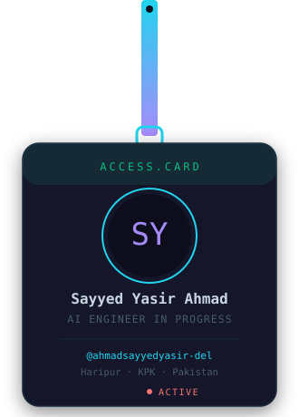

<picture>
  <source media="(prefers-color-scheme: dark)" srcset="./dark.svg">
  <source media="(prefers-color-scheme: light)" srcset="./light.svg">
  
</picture>

 

<table align="center" border="0">
<tr>
<td width="32%" align="center" valign="middle">

</td>
<td width="68%" valign="middle">

### 🧠 Things I've Built

| 🧩 Project | 💻 Tech |
|:---|:---|
| [🎙️ ai-voice-assistant-groq](https://github.com/ahmadsayyedyasir-del/ai-voice-assistant-groq) | `Python` `Groq API` `Streamlit` |
| [📚 RAG-Mini-Project](https://github.com/ahmadsayyedyasir-del/RAG-Mini-Project) | `Python` `LangChain` `Groq` `Vector DB` |
| [🧩 ai-requirement-engineering-platform](https://github.com/ahmadsayyedyasir-del/ai-requirement-engineering-platform) | `FastAPI` `LangChain` `React` `PostgreSQL` |

 

> 🤖 *"Teaching machines to think, one prompt at a time."*

</td>
</tr>
</table>

 

### 📊 GitHub Stats & Graphs

  

  

  

  

### 🐍 Watch the snake eat my contributions

  

### 📫 Let's Connect

  

  

*⭐️ Learning, building, shipping — one prompt at a time.*

ye mera readme file ha baqi chezain na cheroon jdr pootfolio lagana ha laga loo 
